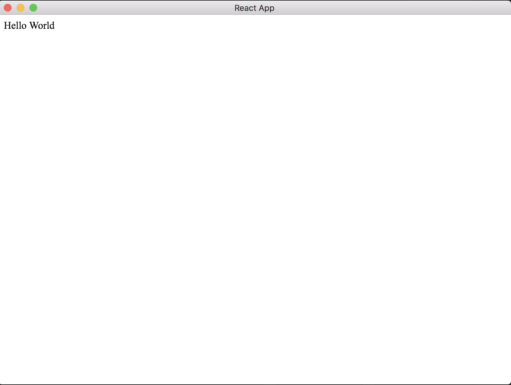

This is the minimal electron app with react.

# USAGE
1. clone this repository. ```git clone git@github.com:tortuepin/min-react-electron.git```
2. ``` npm run install ```
3. ``` npm run build ```
4. ``` npm run start ```

# screen shot

